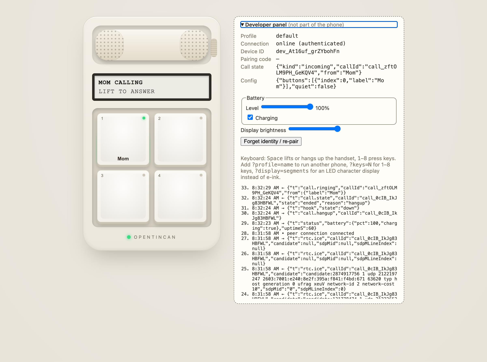

# Open Lounge Phone

A free, open-source, screen-free phone. Real mechanical keys, a handset, and nothing else: no
browser, no games, no strangers.

- **Kids' phone** — calls only the contacts a guardian approves, respects quiet hours (callers
  get voicemail with a transcript instead of waking anyone up), and its guardian sees when it
  was last online.
- **Voicemail everywhere** — any call that isn't answered (no answer, declined, busy, quiet
  hours, unavailable) goes to a greeting — the standard one, your recorded name, or your own —
  and the message lands in the callee's inbox, across servers too.
- **Lounge phone** — a shared phone anyone in the space takes over as themselves by scanning its
  code and pressing the key it flashes; it forgets them the moment they're done. People from
  other servers can use it too, if the space allows guests.
- **Grown-ups** use the companion app on their own phone or computer, or any old device as a
  phone (`/device/`, add it to the home screen).

<p align="center">
  
</p>

Run it on **your own Cloudflare account** or **self-host it with Docker**; to just try it, use the
free public hub at [hub.openloungephone.app](https://hub.openloungephone.app). Your keys and your
server are yours: nothing depends on this project ([security model](docs/security-model.md)). Servers connect to each other, so everyone can reach everyone: you
knock on someone's address (`name@server`), and once they accept you can call. Nobody —
including this project — sits in the middle of your calls, and there is no bridge to the phone
network, ever.

## Status

The software works end to end today. The hardware has its first **early dev board prototype**:
[hardware v0.1](https://github.com/Open-Lounge-Phone/open-lounge-phone/releases/tag/hw-v0.1) (rev A), ordered from JLCPCB on 2026-09-30. Its files are in that release. **Board v0.9 is coming soon** as a fully assembled board or a bare PCB; [join the interest list](https://github.com/Open-Lounge-Phone/open-lounge-phone/discussions/1).

| Phase | What | State |
|---|---|---|
| M0–M4 | Protocol and core logic; self-hosted server, browser phone, companion app; Cloudflare backend; invites, passkeys, voicemail with transcripts | done |
| Lounge | QR takeover with a key-press proof, ephemeral sessions, "open to chat" | done (software) |
| Security (software) | Four-word device fingerprint (phone MENU → About, pairing, the phone's page); phone page with last seen, software version and remove-and-wipe; retention defaults and transcription on/off per space | done (software) |
| Recording (C2) | Opt-in per space (never with kids' phones), always announced to every party (spoken prompt, the phone's status light and `REC` on its display, a mark in the apps, other servers too), made by the recording side's own client and uploaded, in the timeline and call log, transcribed only where the space transcribes, expiring with history; other servers may refuse recorded calls | done (software) |
| Device lifecycle | Modes at claim (kids, personal desk phone, Lounge); per-space Lounge session length (idle, end of day, until logout); optional house-line keys and "who's here" on idle Lounge phones (off by default); remove = the phone wipes itself | done (server, apps, browser phone); firmware: remove = wipe done, modes and factory reset later |
| P1 / P1b | Accounts and handles (`name@server`), several households per account, open sign-up; spaces (home, team, organization); handles reserved 90 days | done |
| P2 | Connections ("buddies"): knock, accept, decline, block — on one server and across servers (signed server-to-server requests) | done |
| P3 | Calls across servers, voicemail, opt-in presence, Lounge guests from other servers | done |
| P4 | The public hub: free, donation-funded, fair-use allowance, Turnstile, operator view, export and account deletion | **live** at hub.openloungephone.app (2026-09-29) |
| Voicemail everywhere | Unanswered calls go to voicemail for every caller and callee (people, kids' phones, Lounge guests, other servers); greetings (standard, recorded name, custom); ring time; recording the greeting on the phone | done (software) |
| P2b | Buddy timeline: per-connection history of calls and voicemails (with transcripts), expiring per connection or by your default (30 days / 1 year / forever); no text chat | done (software) |
| M5 | One-command CLI, `npx openloungephone`: `deploy cloudflare` (prompts, preflight, summary; keys never echoed), `selfhost init` (compose.yaml + .env with random secrets, optional coturn/LiveKit), `status <url>`, `doctor` | done; the desktop (Tauri) app was dropped — the installable web apps cover it |
| P3.5 | Rooms: party lines, phone rooms with addresses (`standup@host`, dialable from any phone's key), host mute/remove/lock, cross-server join; hold, instant 3-way (Add caller → Merge) and blind/attended transfer; a peer-to-peer mesh (≤ 4) or a relay (Cloudflare Realtime SFU, or LiveKit when self-hosting) with top-3 forwarding, idle drop and fair-use metering | done (software); relayed rooms are encrypted in transit, end-to-end (SFrame) planned |
| P6 (C1) | Team and org spaces as a workplace phone system: owner/admin/member roles, searchable directory, extensions (companion and phone MENU → Dial ext), ring groups (simultaneous, sequential, round robin), business hours with after-hours actions, shared voicemail boxes ("heard by"), call log with CSV export, audit trail, transfer across households and servers inside the space ([docs/workplace.md](docs/workplace.md)) | done (software) |
| P5 | Interop tests in CI (two self-hosted servers and two Workers under `wrangler dev`, on every push) and a versioned federation spec, [docs/federation-spec.md](docs/federation-spec.md) | done |
| Versions | Servers advertise their software, federation versions and features and negotiate per peer (degrading in plain words); phones and servers exchange protocol ranges (`UPDATE NEEDED` on a too-old phone); v1 frozen by conformance vectors (`tests/conformance/`); CI runs this server against the previous release (`server-v*`) both ways | done |
| Firmware | ESP32-S3 firmware v0 (ESP-IDF, [firmware/](firmware/README.md)): keys, hook, ringer, status light, 2.9" e-paper strip; Wi-Fi and server from the console; pairing with a P-256 key, sign-in, `wipe`; calls ring, answer and hang up (signaling only); a Wokwi simulation and a live end-to-end test | v0 done in the simulator (2026-09-30), not yet on a board; next: call audio (esp-webrtc), SoftAP Wi-Fi setup, OTA, encrypted NVS |
| Hardware | A minimal 2-layer board (ESP32-S3, 12 hot-swap keys + hook switch, a 2.9" e-paper display module on a header, 3.5 mm jack + codec for an analog handset, piezo ringer, one status LED; USB-C power, no battery, NFC, speaker or hardware mute) in a 3D-printable base | **v0.1 early dev board prototype** ([`hw-v0.1`](https://github.com/Open-Lounge-Phone/open-lounge-phone/releases/tag/hw-v0.1), rev A): designed, routed (DRC clean) and first boards ordered 2026-09-30; bring-up pending; product enclosure not designed yet (a prototype box exists) |

More: [architecture](docs/architecture.md), [federation](docs/federation.md) (and its
[spec](docs/federation-spec.md)),
[the public hub](docs/hub.md), [privacy](docs/privacy.md), [hardware](hardware/README.md).

## Layout

```
packages/protocol    wire protocol (zod schemas) — the contract every device speaks
packages/core        pure domain logic shared by all backends and devices
packages/db          SQL migrations + typed store (Cloudflare D1 and SQLite)
packages/federation  server-to-server signatures (RFC 9421, Ed25519), keys, /fed/v1 schemas
packages/server-app  backend-agnostic HTTP API, connection gateway, household hubs, federation
packages/client      browser helpers: socket, WebRTC call media, tones
apps/server-selfhost Node server (+ Dockerfile, compose.yaml with coturn)
apps/server-cloudflare Worker + Durable Objects + D1 + R2, and the deploy script
apps/cli             `npx openloungephone`: deploy, self-host setup, status, doctor
apps/device-web      the phone in a browser (keys, LEDs, status strip, handset)
apps/companion       companion PWA for guardians, grown-ups and operators
firmware/            ESP32-S3 firmware (ESP-IDF) and its Wokwi simulation
hardware/            schematic, board layout and prototype box, all as code
docs/                architecture, federation (+ spec), hub, privacy, generated protocol reference
```

## Repositories

| Repository | What |
|---|---|
| [open-lounge-phone](https://github.com/Open-Lounge-Phone/open-lounge-phone) (this one) | the product: software, firmware, hardware sources, docs and tests |
| [website](https://github.com/Open-Lounge-Phone/website) | the project site, [openloungephone.app](https://openloungephone.app), built from this repository's docs |
| [.github](https://github.com/Open-Lounge-Phone/.github) | the GitHub organization profile |

## Try it

```sh
npm install
npm start
```

Open the setup link the server prints, create your household, then open
`http://localhost:8787/device/` in another tab. That's the phone. Press Space to lift its
handset and it reads out a pairing code; enter it in the companion app, then call each other.
To run a real server, `npx openloungephone selfhost init` (Docker; see
[docs/self-hosting.md](docs/self-hosting.md) — the Docker packaging has not been build-tested
yet) or `npx openloungephone deploy cloudflare` (your own Cloudflare account; see
[docs/cloudflare.md](docs/cloudflare.md)). `npx openloungephone doctor` checks this machine.

## Development

Requires Node 22.18+ (it runs the TypeScript sources directly).

```sh
npm install
npm test            # unit tests (including a two-server federation test)
npm run check       # lint + typecheck + tests (what CI runs)
npm run docs:protocol     # regenerate docs/protocol.md after changing packages/protocol
npm run docs:federation   # regenerate docs/federation-spec.md after changing packages/federation
OLP_E2E_CLOUDFLARE=1 npx vitest run tests/e2e/cloudflare.test.ts   # two local Workers (after npm run build)
```

CI runs `npm run check` (including the v1 conformance vectors), both docs drift checks, and the
`Interop` workflow (two self-hosted servers, two Workers under `wrangler dev`, and this server
against the previous release in both directions, federating with each other).

## License

Software: [AGPL-3.0-or-later](LICENSE). Hardware designs: [CERN-OHL-S-2.0](hardware/LICENSE).
If you run a modified Open Lounge Phone server for others, you must share your changes.

Proudly supported by [unsubscribe.llc](https://www.unsubscribe.llc/).
