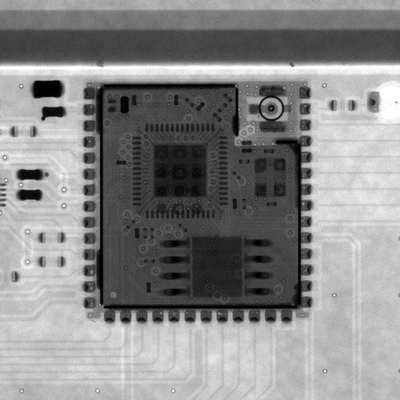

# Open Lounge Phone: building the minimal board

One 2-layer board, one BOM (`build/main/bom.csv`, `make build`). JLCPCB is the reference path
(LCSC codes in the BOM, `bom-jlc.csv`), but any fab or PCBA service works; the M2 layout will
produce Gerber X2 + Excellon, IPC-2581, a generic BOM and pick-and-place.

**Status:** schematic only (M1). There is no layout yet, so nothing to order.

## Ways to build one

1. **PCBA (reference).** JLCPCB economic PCBA, one side (all SMD parts on the bottom, DESIGN.md
   §9). Then plug in 13 MX switches, the keycaps, the display module cable, the antenna and the
   handset. The header and the piezo are through-hole: let JLC fit them or solder them yourself.
2. **By hand.** Everything except the ES8311 is iron-friendly (0603 passives, SOT-23, SOT-223,
   SOT-23-6, the tact switches, the jack, the USB-C receptacle with through-hole shell tabs, the
   hot-swap sockets). The ES8311 (QFN-20, 0.4 mm pitch) and the ESP32 module's ground pad need
   paste and hot air or a hot plate.

## Notes

- **Antenna:** a 2.4 GHz antenna with a U.FL (MHF I) plug snaps onto U1. Only the same type as
  Espressif's certification antenna with gain ≤ 2.33 dBi stays inside the module's
  certification (DESIGN.md §3).
- **Handset:** any analog handset or headset with a 3.5 mm **CTIA** plug (e.g. Opis 60s Micro).
- **Display:** the WeAct 2.9" e-paper module plugs into J3 (2x4 socket; swap its right-angle
  header for a straight 2x4 male header) and rests on two M3 × 11 mm standoffs in H5/H6; other
  SPI modules with jumper wires (DESIGN.md §6).
- **Flashing:** plug a computer into the USB-C port; the ESP32's native USB shows up as a
  serial/JTAG device. Hold BOOT and press RESET for download mode.
- **First power-up:** a current-limited 5 V supply (300 mA) on USB-C; check 3V3 (3.25-3.35 V)
  before plugging in the display module and handset.

## Quality control: X-ray of a first-draft board

Five X-ray scans of one assembled first-draft board (scan set `13690919A-Y2`, 2026-10-08), aligned
on the ESP32-S3 module so only the scan angle changes. They are for quality control: the solder
joints under and around the module (the edge pads and the ground pad) show up from angles that a
camera can't see. `tools/xray_gif.py OUT.gif SCAN... --box x0 y0 x1 y1` rebuilds the GIF from any
scan set (the box is a rectangle around the part in the second scan). The raw scans are not kept in
the repository.
